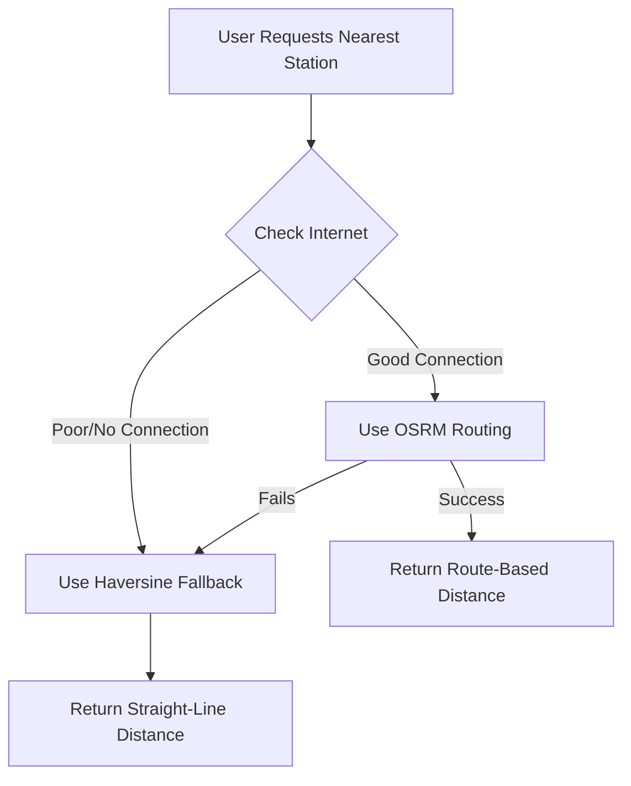

# Hybrid Routing System Documentation

## Overview

The ResMe Emergency Application now uses a **hybrid routing system** that calculates the **shortest route/path** instead of straight-line distance. This provides more accurate distance and time estimates for emergency response.

## Architecture

### Components

1. **RoutingService** (`lib/services/routing_service.dart`)
   - OSRM (Open Source Routing Machine) integration
   - Route caching for performance
   - Batch station distance calculation

2. **OfflineEmergencyService** (`lib/services/offline_emergency_service.dart`)
   - Hybrid routing logic
   - Automatic fallback to Haversine formula
   - Internet connectivity detection

3. **MapRouteHelper** (`lib/services/map_route_helper.dart`)
   - Route visualization on MapLibre maps
   - Distance and duration formatting
   - Route info UI components

## How It Works

### Online Mode (Good Internet Connection)
```
User Location → OSRM API → Actual Road Route → Nearest Station
                ↓
         Route Distance (km)
         Route Duration (min)
         Route Geometry (for map display)
```

### Offline Mode (No Internet / Poor Connection)
```
User Location → Haversine Formula → Straight-Line Distance → Nearest Station
                ↓
         Approximate Distance (km)
```

### Hybrid Decision Flow



## Key Features

### 1. Intelligent Routing
- **OSRM Priority**: Uses actual road networks when online
- **Automatic Fallback**: Switches to Haversine when offline
- **Quality Detection**: Checks internet quality before routing

### 2. Performance Optimization
- **Route Caching**: Stores routes for 6 hours
- **Batch Processing**: Checks top 10 closest stations only
- **Fast Timeouts**: 5-10 second limits to prevent delays

### 3. Accurate Results
- **Distance**: Actual road distance in kilometers
- **Duration**: Estimated travel time in minutes
- **Geometry**: Complete route coordinates for map display

## API Usage

### Find Nearest Station (Hybrid)

```dart
final offlineService = OfflineEmergencyService();

final nearestStation = await offlineService.findNearestStationHybrid(
  userLat: 6.1164,
  userLng: 125.1716,
  forceHaversine: false, // Optional: force Haversine mode
);

if (nearestStation != null) {
  print('Station: ${nearestStation['name']}');
  
  // Check which method was used
  if (nearestStation.containsKey('routeDistance')) {
    // OSRM routing was used
    print('Route distance: ${nearestStation['routeDistance']} km');
    print('Route duration: ${nearestStation['routeDuration']} min');
  } else if (nearestStation.containsKey('straightLineDistance')) {
    // Haversine fallback was used
    print('Straight-line distance: ${nearestStation['straightLineDistance']} km');
  }
}
```

### Get Route Details

```dart
final offlineService = OfflineEmergencyService();

final route = await offlineService.getRouteToStation(
  userLat: 6.1164,
  userLng: 125.1716,
  station: stationData,
);

if (route != null) {
  print('Distance: ${route['distance']} km');
  print('Duration: ${route['duration']} min');
  
  // Route coordinates for map display
  List<dynamic> coordinates = route['coordinates'];
}
```

### Display Route on Map

```dart
import 'package:maplibre_gl/maplibre_gl.dart';
import 'services/map_route_helper.dart';

// Add route line to map
final line = await MapRouteHelper.addRouteToMap(
  mapController: _mapController,
  routeCoordinates: route['coordinates'],
  lineColor: Colors.blue,
  lineWidth: 5.0,
);

// Fit map to show entire route
await MapRouteHelper.fitMapToRoute(
  mapController: _mapController,
  routeCoordinates: MapRouteHelper.convertRouteCoordinates(route['coordinates']),
  padding: 50.0,
);

// Display route info card
Widget routeInfo = MapRouteHelper.buildRouteInfoCard(
  distance: route['distance'],
  duration: route['duration'],
  stationName: station['name'],
  onNavigate: () {
    // Handle navigation
  },
);
```

## OSRM Configuration

### Public Instance (Default)
- **URL**: `https://router.project-osrm.org`
- **Free**: Yes
- **Rate Limits**: Reasonable for emergency app usage
- **Coverage**: Worldwide

### Self-Hosted (Production Recommended)

For production deployment, consider hosting your own OSRM server:

1. **Download Philippines OSM Data**
   ```bash
   wget http://download.geofabrik.de/asia/philippines-latest.osm.pbf
   ```

2. **Process with OSRM**
   ```bash
   docker run -t -v "${PWD}:/data" osrm/osrm-backend osrm-extract -p /opt/car.lua /data/philippines-latest.osm.pbf
   docker run -t -v "${PWD}:/data" osrm/osrm-backend osrm-partition /data/philippines-latest.osrm
   docker run -t -v "${PWD}:/data" osrm/osrm-backend osrm-customize /data/philippines-latest.osrm
   ```

3. **Run OSRM Server**
   ```bash
   docker run -t -i -p 5000:5000 -v "${PWD}:/data" osrm/osrm-backend osrm-routed --algorithm mld /data/philippines-latest.osrm
   ```

4. **Update Configuration**
   ```dart
   // In lib/services/routing_service.dart
   static const String _osrmBaseUrl = 'http://your-server:5000';
   ```

## Performance Metrics

### OSRM Routing
- **Request Time**: 200-500ms (good connection)
- **Cache Hit**: < 1ms
- **Accuracy**: ±50m on actual roads

### Haversine Fallback
- **Calculation Time**: < 1ms
- **Accuracy**: Straight-line only (no road consideration)
- **Use Case**: Offline or poor connectivity

### Caching
- **Cache Duration**: 6 hours
- **Storage**: SharedPreferences (local device)
- **Cache Key**: Rounded coordinates (4 decimal places)

## Testing

### Test OSRM Connectivity

```dart
final routingService = RoutingService();
bool isWorking = await routingService.testOSRMConnectivity();

if (isWorking) {
  print('✅ OSRM is accessible');
} else {
  print('❌ OSRM is not accessible');
}
```

### Test Hybrid Routing

```dart
// Force online mode
final onlineResult = await offlineService.findNearestStationHybrid(
  userLat: 6.1164,
  userLng: 125.1716,
  forceHaversine: false,
);

// Force offline mode
final offlineResult = await offlineService.findNearestStationHybrid(
  userLat: 6.1164,
  userLng: 125.1716,
  forceHaversine: true,
);
```

### Cache Management

```dart
final routingService = RoutingService();

// Get cache statistics
final stats = await routingService.getCacheStats();
print('Total routes: ${stats['totalRoutes']}');
print('Valid routes: ${stats['validRoutes']}');
print('Expired routes: ${stats['expiredRoutes']}');

// Clear cache
await routingService.clearRouteCache();
```

## Comparison: Before vs After

### Before (Haversine Only)
```
User at (6.1164, 125.1716)
Station A at (6.1264, 125.1816) - 1.2 km straight-line
Station B at (6.1364, 125.1916) - 2.8 km straight-line

Result: Station A selected (closer straight-line)
```

### After (OSRM Routing)
```
User at (6.1164, 125.1716)
Station A at (6.1264, 125.1816) - 3.5 km by road (8 min)
Station B at (6.1364, 125.1916) - 2.2 km by road (5 min)

Result: Station B selected (shorter actual route)
```

**Why?** Station B might have better road access despite being farther in straight-line distance.

## Troubleshooting

### OSRM Not Working
1. Check internet connectivity
2. Verify OSRM URL is accessible
3. Check firewall/proxy settings
4. System will automatically fallback to Haversine

### Slow Routing
1. Check internet quality
2. Reduce `maxStationsToCheck` parameter
3. Clear route cache if corrupted
4. Consider self-hosting OSRM

### Incorrect Routes
1. Verify coordinate order (lat, lng)
2. Check if coordinates are in valid range
3. Ensure OSRM has map data for your region
4. Test with known coordinates

## Future Enhancements

### Planned Features
- [ ] Turn-by-turn navigation instructions
- [ ] Real-time traffic integration
- [ ] Multiple route alternatives
- [ ] Offline routing with local map data
- [ ] Route optimization for multiple stations
- [ ] ETA updates during travel

### Alternative Routing Engines
- **GraphHopper**: Open source, Java-based
- **Valhalla**: Open source, C++, advanced features
- **Google Directions API**: Commercial, highly accurate
- **Mapbox Directions API**: Commercial, good free tier

## References

- [OSRM Documentation](http://project-osrm.org/)
- [MapLibre GL Documentation](https://maplibre.org/)
- [Haversine Formula](https://en.wikipedia.org/wiki/Haversine_formula)
- [OpenStreetMap](https://www.openstreetmap.org/)

## Support

For issues or questions about the routing system:
1. Check debug logs for detailed error messages
2. Test OSRM connectivity
3. Verify internet connection quality
4. Review cache statistics

---

**Last Updated**: November 5, 2025  
**Version**: 1.0.0  
**Maintained by**: ResMe Development Team
